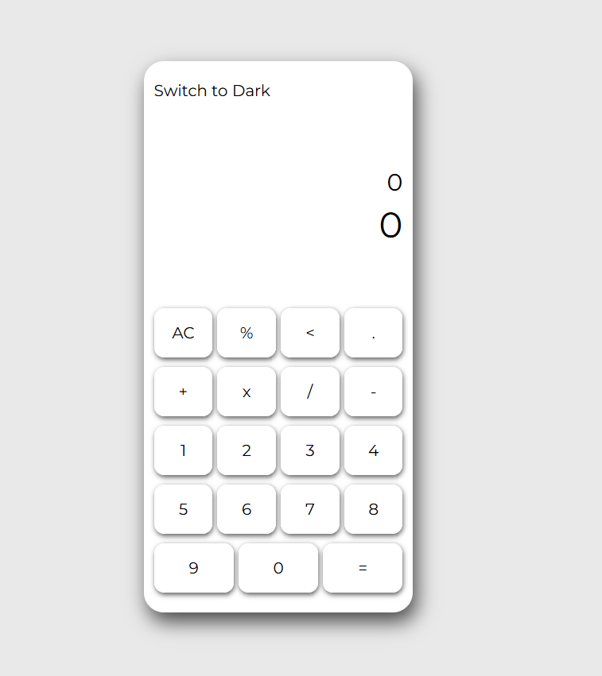
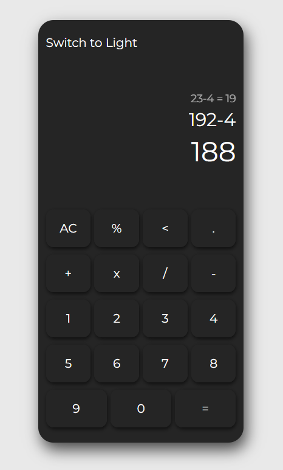

# React-Calculator - a simple app for everyday calculations

## ScreenShots




## Features

- Basic math operations
- History saving
- Real time result
- Supports dark and light themes
- Responsive design

## Tech stack

- React
- TypeScript
- Vite
- CSS
- math.js
- React Testing Library & vitest

## Installation

```bash
git clone https://github.com/vdreamingb/React-Calculator

cd React-Calculator

npm install

npm run dev
```

## Project Structure

### src/

#### ├── components/

#### ├── hooks/

#### ├── pages/

#### ├── styles/

#### └── utils/

## Author

GitHub: [https://github.com/vdreamingb](https://github.com/vdreamingb)
